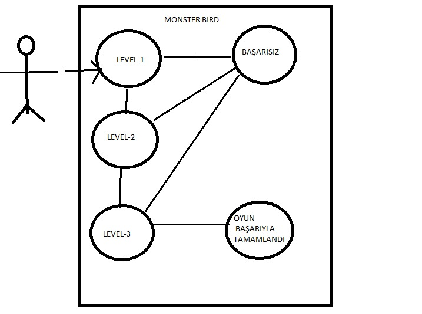

# YAZILIM MÜHENDİSLİĞİNE GİRİŞ 2D OYUN PROJESİ ÖN RAPOR

<b>MONSTER  BİRD 2D OYUN PROJESİ</b>
 
192503070 <B> YEŞİM SALMAN </B>  182503043 <B>ALEYNA AYNA</B>  182503057 <B> HARUN ERDOĞAN </B>

   
<B>İÇİNDEKİLER</B>

1.GİRİŞ................................................................

 * 1.PROJE ÖNERİSİ..........................................
 * 2.PROJE AMACI.............................................
 * 3.PROJE NEDENİ VE ÖNEMİ........................
 * 4.USE CASE DİYAGRAMI...............................
     

>1.  Grubumuz için sürdürülebilir faydalar sağlamak ve Yazılım Mühendisliğine Giriş dersi vasıtasıyla yazılım dillerinden Unity C# ile kodlayarak, bu yazılım dilinde yapıcı ve keşfedici olarak kendimizi geliştirmemizi sağlayacak    bir proje yapmayı hedefledik.
&nbsp;  &nbsp;   &nbsp;   &nbsp;   &nbsp; Bu proje ile araştırmayı alışkanlık haline getirmeyi, yeni gelişme veya teknolojileri algılayabilme, grup olarak hareket edip yapıcı düşünerek verileri doğru ve amacına uygun kullanmayı ayrıca yazılım konusunda eksikliklerimizin farkına varıp kendimizi geliştirmeyi baz alarak oyun projemizi oluşturmayı hedefledik. Böylece kendimizi geliştirip, iletişim ve toplu çalışma yeteneğimizi güçlendirip konular arası ilişki kurabilme becerimizi arttırmış olacağız. 
>***
>
> 2. Bu proje bizim de ilgi alanımız içerisinde yer alan bir oyun projesidir. Oyunumuz da bir kuşun hareketine dayalı, engelleri devirme, düşmanlarını alt etmeye yönelik bir kurgu geliştirdik. İki boyutlu olarak ele alınmıştır. Mevcut sistemde grafikler internetten hazır olarak indirerek projeye import etmeyi veya değiştirmeyi, proje gereksiniminden kaynaklı olarak düşünüyoruz.
>***
>
> 3. Bu oyun gelişime açık bir tasarım yapısına sahiptir. Unity fizik kurallarına uygun hareket etmesi durumundan dolayı artırılabilir ve ölçeklendirilmesi konusunda uğraşlara açık bir yapıya sahiptir. İnternette Flappy Bird, Anker Bird ve Angry Bird isimleri ile çeşitli versiyonları bulunmaktadır. Bu oyunlardan esinlenerek, kurmak için ilk adımları attığımız oyunumuz farklı yönleri ile bizim açımızdan yeni şeyler keşfetmeyi, kullanıcı açısından da eğlenceli zaman geçirmeyi sağlıyor.  

 
 
 

4. 